## Overview
각 회원들의 개인 일정을 설정하는 페이지입니다. 일정 관리에 필요한 기본적인 기능들이 포함되어 있습니다.
<ul>
    <li>일정 생성, 조회, 수정, 삭제를 통하여 자신의 일정을 관리하고 다른사람의 일정을 조회해볼 수 있습니다.</li>
    <li>로그인한 사람에 한해서만 페이지에 접근할 수 있게 구현하였습니다.</li>
    <li>다른사람의 정보에 접근할 수 없도록 프론트단과 백엔드 단에서 벨리데이션 체크를 하여 잘못된 접근을 방지하였습니다.</li>
</ul>

## 풀캘린더
풀캘린더 화면과 데이터 파싱을 사용하는 페이지들은 모두 한 스크립트와 jsp를 사용하였습니다.
<ul>
    <li>jsp 페이지를 인클루딩 해오는 방식으로 하나의 풀캘린더를 구현 후 인클루딩하여 여러 페이지에서 사용하였습니다</li>
    <li>main.js 파일에 풀캘린더 div에 데이터를 파싱해주는 메서드를 정의하여 사용하였습니다.</li>
</ul>

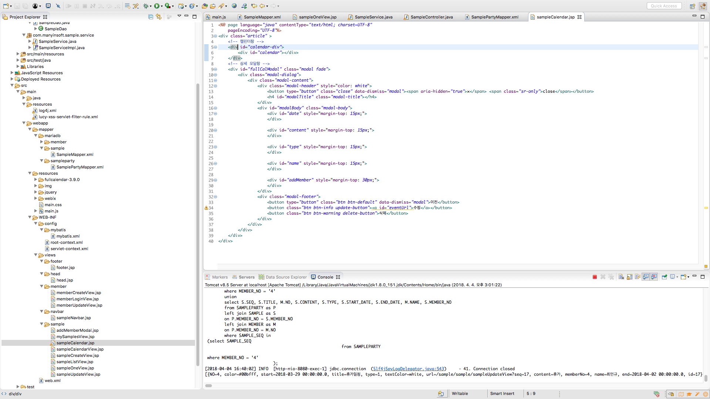
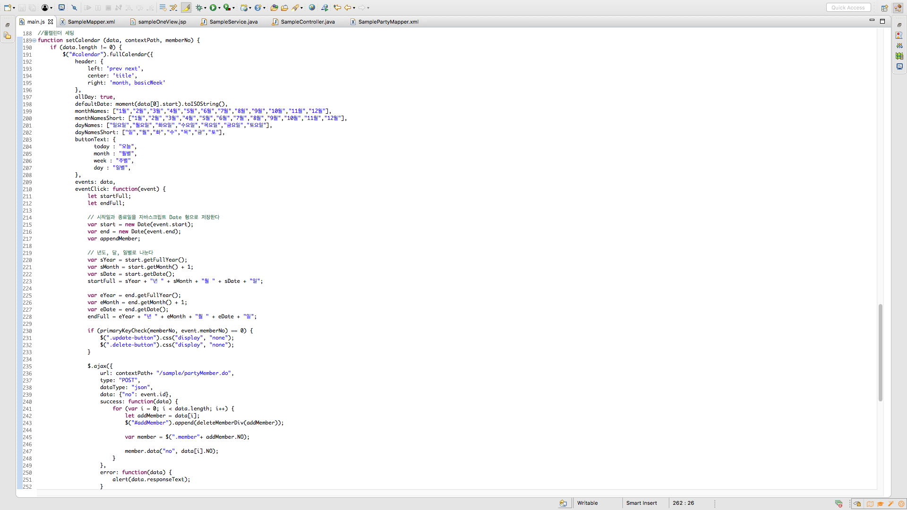

## 회원가입
회원가입시 해야하는 기본적인 벨리데이션 체크를 하였습니다.
<ul>
    <li>이메일, 이름, 비밀번호, 비밀번호 확인, 성별, 부서, 직급 정보를 입력받고 해당 데이터가 입력되지 않았을 경우 해당 태그에 포커싱되게 하고 회원가입이 되지 않게 하였습니다.</li>
    <li>이메일은 ex) sattlub123@gmail.com 처럼 @ 앞에 아이디 뒤에 메일주소를 입력하지 않으면 회원가입이 되지 않도록 하였습니다.</li>
    <li>회원정보 등록시 db에서 이메일의 중복 여부를 체크하여 중복되어있을 경우 중복된 이메일이라는 경고창과 함께 회원가입이 되지 않도록 하였습니다.</li>
    <li>이름은 2~10글자 이내로 한글 및 영문만 입력하게 하였습니다.</li>
    <li>비밀번호와 비밀번호 확인은 영문+숫자+특수문자 조합으로 8~16이내의 정보를 입력하지 않거나 둘의 값이 다를 경우 회원가입이 되지 않도록 하였습니다.</li>
</ul>

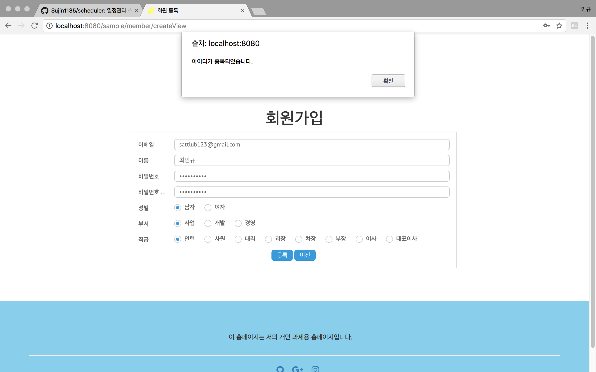

        //공백체크 및 비밀번호 & 비밀번호 확인 일치여부 확인

        var email = $$("email").getValue();
        // 이메일 공백확인
        if (spaceCheck(email, "email", "이메일을 입력하세요.") == 0) return;
        
        var name = $$("name").getValue();
        
        // 이름 공백 확인
        if (spaceCheck(name, "name", "이름을 입력하세요.") == 0) return;
        
        var pwd = $$("pwd").getValue();
        var pwdCheck = $$("pwdCheck").getValue();
        
        // 비밀번호 공백 확인
        if (spaceCheck(pwd, "pwd", "비밀번호를 입력하세요") == 0) return;
        
        // 비밀번호확인 공백 확인
        if (spaceCheck(pwdCheck, "pwdCheck", "비밀번호 확인을 입력하세요.") == 0) return;
        
        // 비밀번호와 비밀번호 확인이 일치하는지
        if (pwd != pwdCheck) {
            alert("비밀번호와 비밀번호 확인이 일치하지 않습니다.");
            $$("pwd").focus();
            $$("pwdCheck").focus();
            return;
        }
        
        var dept = $$("dept").getValue();
        
        // 부서 선택여부 확인
        if (spaceCheck(dept, "dept", "부서를 선택하세요.") == 0);
        
        var classes = $$("classes").getValue();
        
        // 직급 선택여부 확인
        if (spaceCheck(classes, "classes", "직급을 선택하세요.") == 0);
        
        var gender = $$("gender").getValue();
        
        // 성별 선택여부 확인
        if (spaceCheck(gender, "gender", "성별을 선택하세요.") == 0);

        // 벨리데이션 체크 함수
        if (memberValidation(param)) {
            return;
        }
 
        위의 코드에 정의된 spaceCheck와 memberValidation 메서드
    
        // 공백여부 체크
        function spaceCheck(obj, objName, comment) {
            if(obj == null || obj == "" || obj.length == 0){
                alert(comment);
                $$(objName).focus();
                return 0;
            }
            return 1;
        }

        // 회원정보 벨리데이션 체크
        function memberValidation (param) {
            /*
            * member param 정보
                param.name = name;
                param.email = email;
                param.pwd = pwd;
                param.gender = gender;
                param.dept = dept;
                param.classes = classes;
            */
            
            // 이메일, 이름, 비밀번호의 벨리데이션 체크에 필요한 정규식 표현들
            var emailRegex = RegExp("^[0-9a-zA-Z]([-_\\.]?[0-9a-zA-Z])*@[0-9a-zA-Z]([-_\\.]?[0-9a-zA-Z])*\\.[a-zA-Z]{2,3}$");
            var nameRegex = RegExp("^[가-힣a-zA-Z]{2,10}$");
            var pwdRegex = RegExp("^(?=.*[a-zA-Z])(?=.*[0-9])(?=.*[!~`@#&$%^*()\\-_=+\\\\\\|\\[\\]{};:\\'\"<>\\/?]).{8,16}$"); // 영문 + 숫자 + 특수문자(_ 는 제외) 조합으로 8자 이상 16자 이하로 조합하여야 한다
            
            if (regexCheck(emailRegex, param.email, "이메일 형식이 올바르지 않습니다.") == 0) return true;
            if (regexCheck(nameRegex, param.name, "이름은 2~10글자 내외로 한글, 영문만 입력가능합니다.") == 0) return true;
            if (regexCheck(pwdRegex, param.pwd, "비밀번호는 8~16글자 내외로 문자, 숫자, 특수문자를 조합하여 등록하세요.") == 0) return true;
            
            return false;
        }

        // 정규식 표현 체크를 위한 메서드
        function regexCheck (regex, obj, comment) {
            if (!regex.test(obj)) {
                alert (comment);
                return 0;
            }
            
            return 1;
        }

## 로그인
이메일과 비밀번호 조회결과를 체크합니다.
<ul>
    <li>아이디, 비밀번호를 입력하였는지 공백여부를 체크합니다.</li>
    <li>로그인 정보가 db정보와 일치하지 않는다면 아이디가 틀렸는지 비밀번호가 틀렸는지의 경우를 따로 알려줍니다.</li>
    <li>로그인을 하지 않을경우 로그인 페이지와 회원가입 페이지 이외의 서비스를 이용할 수 없게 하였습니다.</li>
</ul>

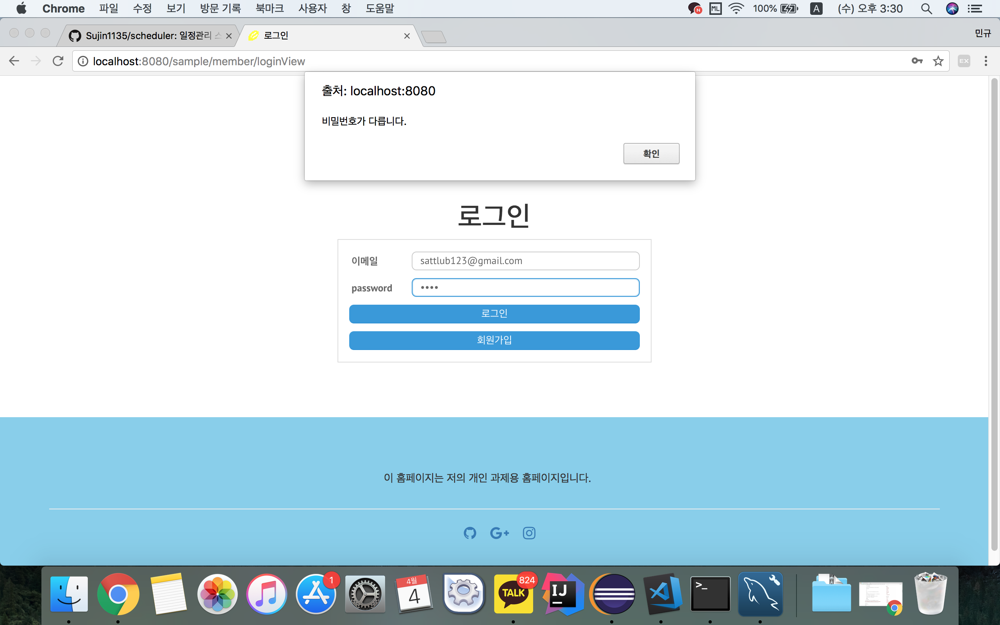

## 일정 목록
등록된 일정들을 조회설정대로 검색하여 조회 결과를 보여줍니다.
<ul>
    <li>화면에서 설정한 타입별로 데이터를 조회하도록 마이바티스에서 쿼리를 정의하였습니다.</li>
</ul>

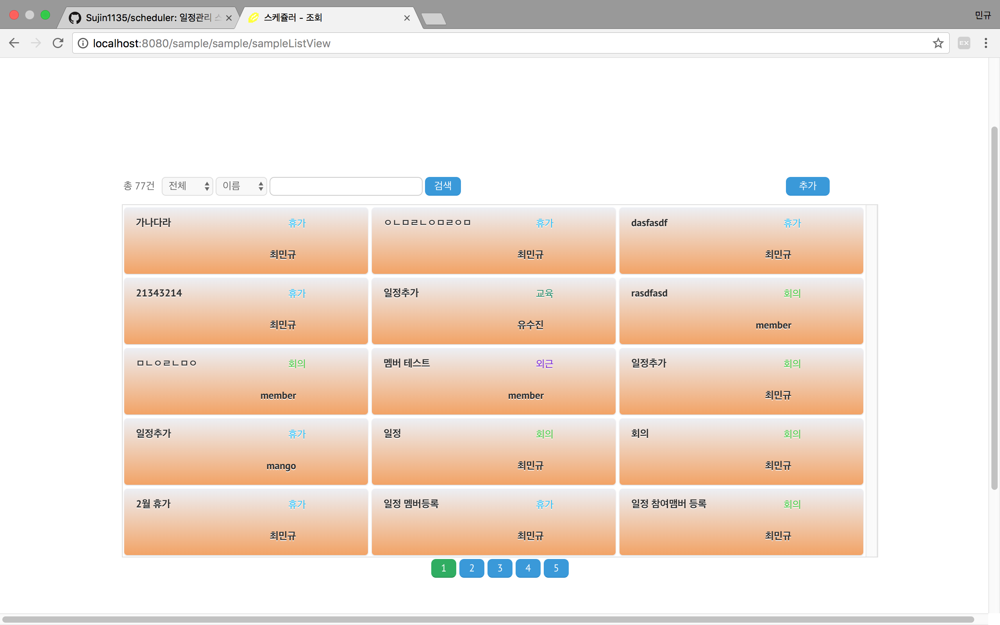

    <select id="searchSample" resultType="hashMap" parameterType="hashMap">
    select SEQ as id,
           SEQ,
           MEMBER_NO,
           TITLE,
           CONTENT,
           TYPE,
           START_DATE,
           END_DATE,
           M.NAME
      from SAMPLE as S
      left join MEMBER as M
      on S.MEMBER_NO = M.NO
     where DELETE_AT = 'N'
    <if test="_parameter != null" >
      <if test="LIKE_TITLE != null">
      	<if test="TYPE_SELECT == 1">
      		and upper(M.NAME) like #{LIKE_TITLE,jdbcType=VARCHAR}
      	</if>
      	
      	<if test="TYPE_SELECT == 2">
        	and upper(TITLE) like #{LIKE_TITLE,jdbcType=VARCHAR}
        </if>
      </if>
    </if>
    
    <if test="CALENDAR_SELECT != 0">
    	and TYPE = #{CALENDAR_SELECT}
    </if>
     order by SEQ desc;
    </select>

  ##일정 등록
  자신의 일정에 관한 정보들을 입력받습니다.
  <ul>
    <li>일정명, 내용, 일정 종류, 시작일, 종료일, 일정을 같이하는 멤버를 등록합니다.</li>
    <li>정보 입력이 누락될 경우를 대비하여 일정을 같이하는 멤버의 정보 이외의 정보들은 공백일 경우 일정등록을 못하게 하였습니다.</li>
  </ul>

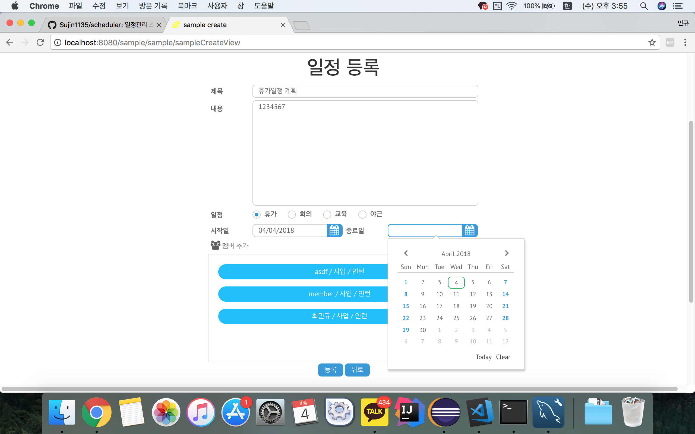
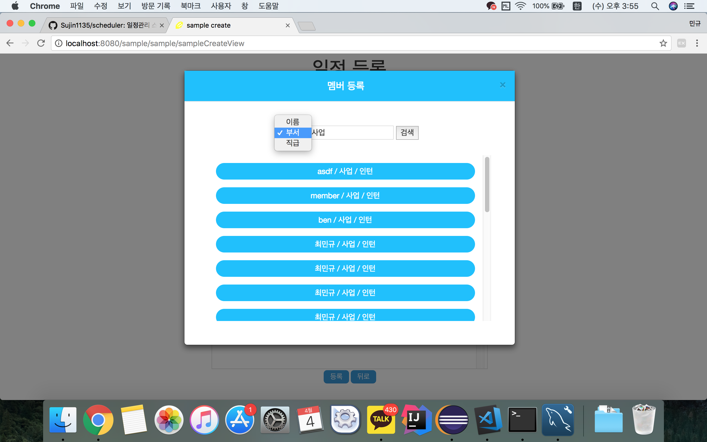

    // 추가된 멤버들을 담을 배열
    var addMemberArr = new Array();

    var title = trim("TITLE");
	if (spaceCheck(title, "TITLE", "제목을 입력하세요.") == 0) return;
	
	var content = trim("CONTENT");
	if (spaceCheck(content, "CONTENT", "내용을 입력하세요.") == 0) return;
	
	var type = $$("TYPE").getValue();
	if (spaceCheck(type, "TYPE", "일정 종류를 체크하세요.") == 0) return;
	
	var startDate = dateFormat($$("STARTDATE").getValue());
	if (spaceCheck(startDate, "STARTDATE", "일정 시작일을 입력하세요") == 0) return;
	
	var endDate = dateFormat($$("ENDDATE").getValue());
	if (spaceCheck(endDate, "ENDDATE", "일정 종료일을 입력하세요") == 0) return;
	
	if (dateCheck(startDate, endDate) == 0) return;
	
	if (title.length > 20 || title.length < 2) {
		alert("글 제목은 2글자 이상 20글자 이하로 작성하세요.");
		return;
	}
	
	if (content.length > 50 || content.length < 2) {
		alert("글 내용은 2글자 이상 50글자 이하로 입력하세요.");
		return ;
	}

    // webix의 id명을 매개변수로 입력받아서 객체값의 좌우 여백을 없애주는 메서드
    function trim(objName) {
	    return $.trim($$(objName).getValue());
    }

##정
일정 정보를 수정하고 일정등록 조건과 같은 벨리데이션 체크를 한다.
<ul>
    <li>일정에 관한 데이터를 받아올 때 초기 멤버배열, 추가 멤버배열, 삭제 멤버배열을 생성하여 기존에 등록되있던 회원 이외의 추가 멤버들만 데이터 테이블에 추가한다.</li>
</ul>

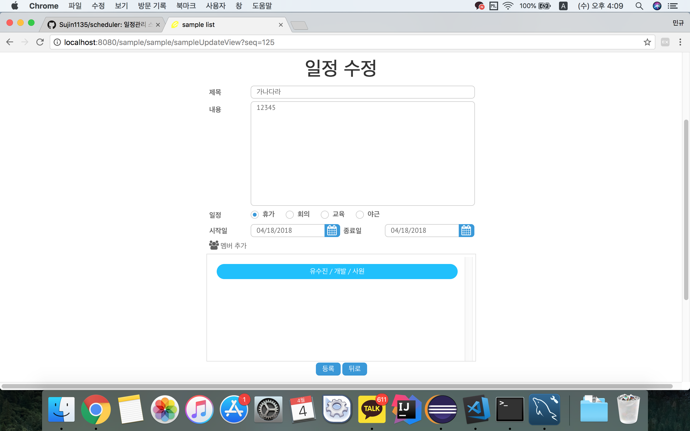

    // 초기 멤버배열
    var initializedMember = new Array();
    // 추가 멤버배열
    var addMemberArr = new Array();
    // 삭제 멤버배열
    var deleteMemberArr = new Array();

    // Submit
    function doSubmit() {
        var title = trim("TITLE");
        if (spaceCheck (title, "TITLE", "제목을 입력하세요.") == 0) return;
        
        var content = trim("CONTENT");
        if (spaceCheck (content, "CONTENT", "내용을 입력하세요.") == 0) return;
        
        var startDate = dateFormat($$("STARTDATE").getValue());
        if (spaceCheck (startDate, "STARTDATE", "시작일을 입력하세요.") == 0) return;
        
        var endDate = dateFormat($$("ENDDATE").getValue());
        if (spaceCheck (endDate, "ENDDATE", "종료일을 입력하세요.") == 0) return;
        
        if (dateCheck(startDate, endDate) == 0) return;
        
        // param에 글 내용 저장
        var param = {};
        
        // 추가해야할 멤버만 골라낸다
        for (var i= 0; i < initializedMember.length; i++) {
            if (addMemberArr.indexOf(initializedMember[i]) != -1) {
                addMemberArr.splice(addMemberArr.indexOf(initializedMember[i]), 1);
            }
        }
        
        param.ADDMEMBERLIST = addMemberArr;
        param.DELETEMEMBERLIST = deleteMemberArr;
        
        param.SEQ = $$("SEQ").getValue();
        param.MEMBERNO = $$("MEMBERNO").getValue();
        param.TITLE = title;
        param.CONTENT = content;
        param.TYPE = $$("TYPE").getValue();
        param.STARTDATE = startDate;
        param.ENDDATE = endDate;
        
        // 수정 정보 전송
        $.ajax({
            type:"POST",
            url:"${pageContext.request.contextPath}/sample/updateSample.do",
            contentType: "application/json",
            data:JSON.stringify(param),
            dataType:"json",
            success:function(data, status, xhr){
                
                if(data.result == "SUCCESS"){
                    goBack("${pageContext.request.contextPath}/sample/sampleListView", "수정되었습니다.");
                }else{
                    alert(data.errorMsg);
                }
            },
            error:function(data, status, xhr){
                alert(data.responseText);
            }
        });
            
        
    }

    // 일정 정보를 가져온다
    function sampleOne () {
        var param = new Object();
        param.SEQ = ${param.seq};
        param.RESULT = "UPDATE";
        
        $.ajax({
            type:"POST",
            url:"${pageContext.request.contextPath}/sample/selectSample.do",
            async:false,
            data:param,
            dataType:"json",
            success:function(data, status, xhr){
                // 날짜 형식 변환
                let startDate = new Date(data.sampleList[0].start);
                let endDate = new Date(data.sampleList[0].end);
                
                $$("SEQ").setValue(data.sampleList[0].id);
                $$("MEMBERNO").setValue(data.sampleList[0].memberNo);
                $$("TITLE").setValue(data.sampleList[0].title);
                $$("CONTENT").setValue(data.sampleList[0].content);
                $$("TYPE").setValue(data.sampleList[0].type);
                $$("STARTDATE").setValue(startDate);
                $$("ENDDATE").setValue(endDate);
            },
            error:function(data, status, xhr){
                alert(data.responseText);
            }
        });
    }

    // 해당 글에 해당된 회원 조회
    function selectPartyMember () {
        var memberList = new Array();
        var no = ${param.seq};
        
        $.ajax({
            url: "${pageContext.request.contextPath}/sample/partyMember.do",
            type: "POST",
            dataType: "json",
            data: {"no": no},
            success: function(data, status, xhr){
                memberList = data;
                
                for (var i=0; i < memberList.length; i++) {
                    let addMember = memberList[i];
                    $("#addMember").append(deleteMemberDiv(addMember));
                    
                    var member = $(".member"+ addMember.NO);
                    
                    member.data("no", memberList[i].NO);
                    
                    deleteEvent (member, addMemberArr, deleteMemberArr);
                    addMemberArr.push(addMember.NO);
                    initializedMember.push(addMember.NO);
                }
            },
            error: function(data, status, xhr) {
                alert(data.responseText);
            }
        });
    }

    //회원 조회
    function searchName () {
        let memberList = new Array();
        let param = {};
        
        param.name = $(".likeName").val();
        param.type = $(".type").val();
        param.writer = ${member};
        
        // 부서명이나 직급을 검색할 경우 index값으로 치환
        if (param.type == "dept") param.name = deptList.indexOf(param.name);
        if (param.type == "classes") param.name = classesList.indexOf(param.name);
        
        $.ajax({
            url: "${pageContext.request.contextPath}/member/searchMember",
            type: "GET",
            data: param,
            success: function (data, status, xhr) {
                console.log(data);
                if (data.memberList[0] == null) {
                    // 검색결과가 없음
                    $("#main").text("검색결과가 없습니다.");
                } else {
                    $("#main").empty();
                    // 검색결과가 있음
                    memberList = data.memberList;
                    
                    for (var i= 0; i < memberList.length; i++) {
                        if (addMemberArr.indexOf(memberList[i].NO) == -1) {
                            $("#main").append(createMemberDiv(memberList[i]));
                            
                            var member = $(".addMember"+ memberList[i].NO);
                            
                            inputElementData (member, memberList[i]);
                            
                            memberClickEvent (member, addMemberArr, deleteMemberArr);
                        }
                    }
                }
            },
            error: function (data, status, xhr) {
                alert(data.responseText);
            }
        });
    }

##일정 상세정보
일정 정보를 보여준다

<ul>
    <li>일정 기간과 일정명을 달력에 표출하고 클릭할 경우 상세 데이터를 나타낸다.</li>
    <li>자기 자신의 일정일 경우에만 수정페이지로 이동하는 버튼과 삭제버튼을 보여준다</li>
</ul>

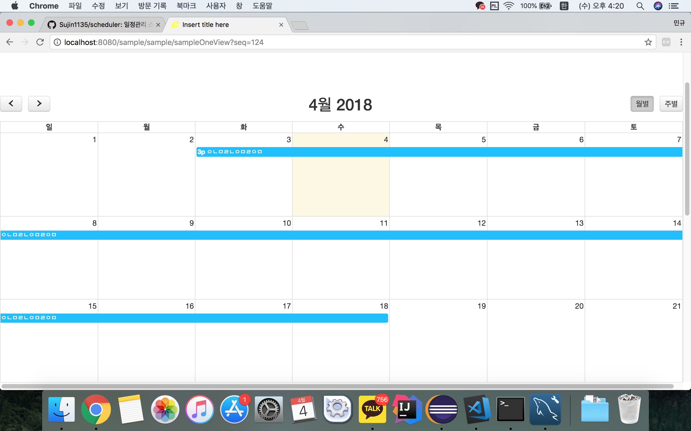
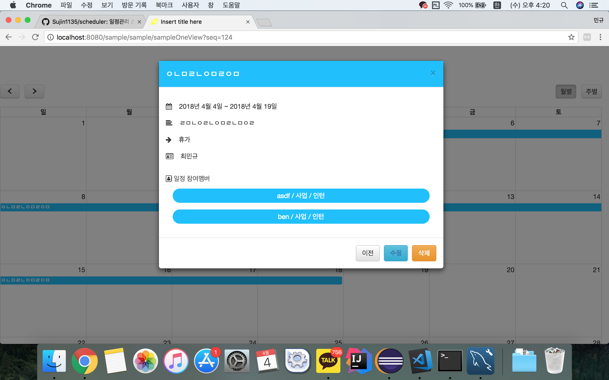

        // 서블릿에서 풀캘린더가 바로 파싱할 수 있도록 키와 값을 설정한다
        // 게시글의 정보를 풀캘린더에서 바로 읽어들일 수 있도록 세팅한다
        private void sampleSettings (HashMap<String, Object> map, String contextPath) {
		// 풀캘린더에서 데이터를 읽어들일수 있게 값 세팅
		map.put("id", map.get("SEQ"));
		map.put("memberNo", map.get("MEMBER_NO"));
		map.put("url", contextPath+ "/sample/sampleUpdateView?seq=" + map.get("SEQ"));
		map.put("textColor", "white");
		map.put("title", map.get("TITLE"));
		map.put("content", map.get("CONTENT"));
		map.put("start", map.get("START_DATE"));
		map.put("end", map.get("END_DATE"));
		map.put("name", map.get("NAME"));
		map.put("type", map.get("TYPE"));
		
		// 키 삭제
		map.remove("SEQ");
		map.remove("MEMBER_NO");
		map.remove("TITLE");
		map.remove("CONTENT");
		map.remove("START_DATE");
		map.remove("END_DATE");
		map.remove("NAME");
		map.remove("TYPE");
		if (map.get("type") != null) {
			int type = Integer.parseInt(map.get("type").toString());
			if (type == 1) {
				// 휴가
				map.put("color", "#00bfff");
			} else if (type == 2) {
				// 회의
				map.put("color", "#32cd32");
			} else if (type == 3) {
				// 교육
				map.put("color", "#088A68");
			} else if (type == 4) {
				// 야근
				map.put("color", "#7401DF");
			}
		}
    }

    
    // url 프로퍼티를 eventUrl의 href 속성으로 등록하여 클릭할 경우 해당 글의 수정페이지로 이동하게 한다.
    $('#eventUrl').attr('href',event.url);

    // 일정 삭제 메서드
    function scheduleDelete (seq, contextPath, memberNo) {
        var param = {};
        param.seq = seq;
        param.memberNo = memberNo;
        
        $.ajax({
            url: contextPath+ "/sample/deleteSample.do",
            type: "POST",
            data: param,
            dataType: "json",
            success: function(data) {
                if (data.result == "SUCCESS") {
                    alert("해당 일정이 삭제되었습니다.");
                    window.location.href= contextPath+ "/sample/sampleListView";
                } else {
                    alert("삭제되지 않았습니다.");
                }
            },
            error: function(data) {
                alert(data.responseText);
            }
        });
    }

## 일정 삭제
일정 pk를 서버에 전달하여 데이터를 삭제한다

<ul>
    <li>일정 데이터의 pk와 등록자 pk를 서버에 전송하여 컨트롤러에서 현재 로그인중인 멤버의 pk와 비교하여 일치할 경우에만 삭제를 한다</li>
    <li>데이터를 삭제시키는게 아닌 일정 테이블의 DELETE_AT 컬럼을 'Y'값으로 변경한다.</li>
</ul>

    // 게시물 삭제
	@ResponseBody
	@RequestMapping(value = "/sample/deleteSample.do", method = RequestMethod.POST)
	public HashMap<String, Object> deleteSample(@RequestParam HashMap<String, Object> requestParam) {
		HashMap<String, Object> resultMap = new HashMap<String, Object>();
		
		try{
			if (session.getAttribute("member") == null) throw new Exception("비로그인 상태");
			
			int memberNo = Integer.parseInt(requestParam.get("memberNo").toString());
			int sessionMemberNo = Integer.parseInt(session.getAttribute("member").toString());
			if (memberNo != sessionMemberNo) throw new Exception("사용자 정보가 다름");
			sampleService.deleteSample(requestParam);
			
			resultMap.put("result", "SUCCESS");
		}catch(Exception e){
			resultMap.put("result", "FAIL");
			resultMap.put("errorMsg", e.getMessage());
		}
		
		return resultMap;
	}

    // 쿼리 부분
    <update id="deleteSample" parameterType="hashMap">
    update SAMPLE
    set DELETE_AT = 'Y'
    where SEQ = #{seq,jdbcType=INTEGER}
    </update>

## 캘린더 메뉴
사이드바에서 캘린더 메뉴로 들어가면 모든 일정 조회를 캘린더 화면으로 받아볼 수 있다
<ul>
    <li>일정 목록 조회조건이랑 똑같으며 일정 데이터를 달력 화면에서 조회해서 볼 수 있다.</li>
</ul>

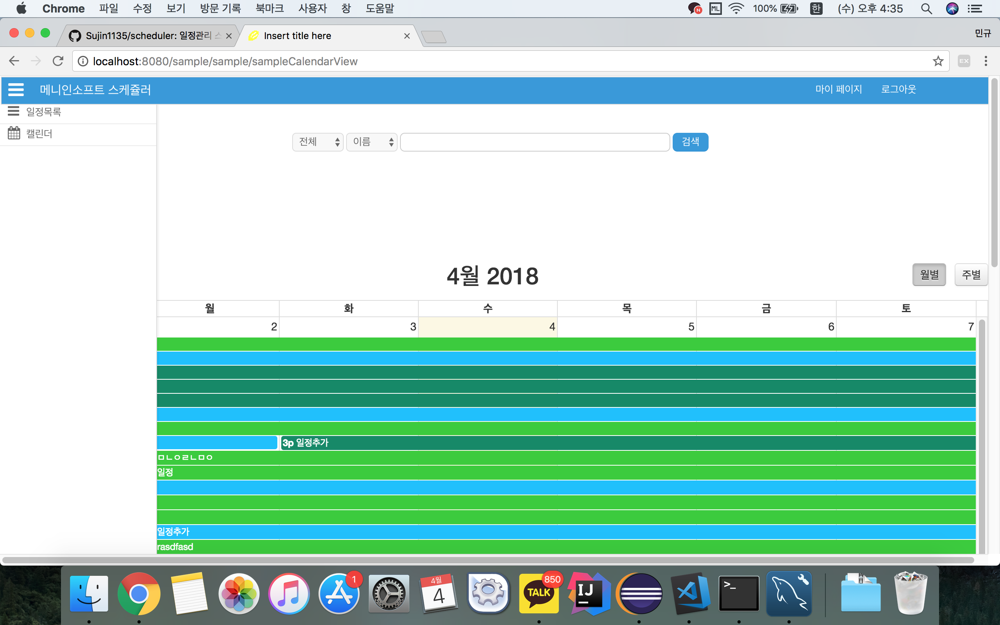

   ## 내 일정
   내 일정만 조회해서 화면에 달력형태로 데이터를 보여준다
    <ul>
        <li>내가 등록한 일정이랑 타인의 일정중 내가 참여하는 일정 데이터를 달력화면으로 보여준다</li>
    </ul>

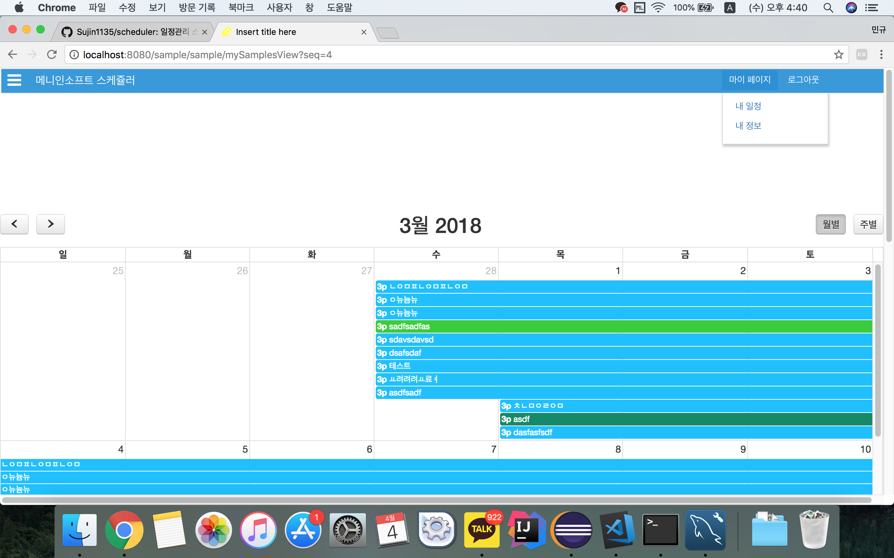

        <!-- 두개의 쿼리를 union을 사용하여 조합한 결과를 중복된 데이터 없이 보여준다 -->
        <select id="mySamples" parameterType="hashmap" resultType="hashmap">
        select SEQ, TITLE, M.NO, CONTENT, TYPE, START_DATE, END_DATE, M.NAME, MEMBER_NO
        from SAMPLE
        left join MEMBER as M
        on MEMBER_NO = M.NO
        where MEMBER_NO = #{memberNo}
        union
        select S.SEQ, S.TITLE, M.NO, S.CONTENT, S.TYPE, S.START_DATE, S.END_DATE, M.NAME, S.MEMBER_NO
        from SAMPLEPARTY as P
        left join SAMPLE as S
        on P.MEMBER_NO = S.MEMBER_NO
        left join MEMBER as M
        on P.MEMBER_NO = M.NO
        where SAMPLE_SEQ in (select SAMPLE_SEQ
                                from SAMPLEPARTY
                                where MEMBER_NO = #{memberNo}
                            );
        </select>